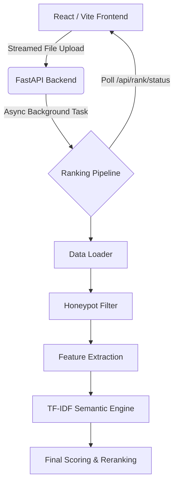

<div align="center">
  
  <h1 style="font-size: 3rem; margin-top: 20px;">Redrob Candidate Ranker</h1>
  <p><strong>An Enterprise-Grade, Full-Stack Candidate Ranking & Discovery System</strong></p>
  
  <p>
    
    
    
  </p>
</div>

---

## 🌟 Overview

The **Redrob Candidate Ranker** is an end-to-end intelligent candidate evaluation system engineered to process massive datasets (e.g., 100,000+ candidates, 400MB+ files) with zero UI freezing or connection drops. 

It moves beyond basic keyword matching by leveraging a highly-optimized hybrid semantic search engine paired with a gorgeous, interactive React dashboard. This enables recruiters to rapidly upload, process, and analyze massive candidate pools in mere seconds, pinpointing top talent efficiently and fairly.

---

## 🧠 Why This Tech Stack?

We deliberately selected our technologies to balance **extreme performance**, **developer experience**, and **production reliability**.

### 🎨 Frontend: React, Vite, and TypeScript
* **React:** Chosen for its component-driven architecture, making it easy to build complex, reactive UIs (like our multi-stage pipeline dashboard and candidate detail drawers) that remain highly maintainable.
* **Vite:** Replaces Webpack to provide a lightning-fast development experience. It starts instantly and offers hot-module replacement (HMR), ensuring our developers can iterate on UI designs without waiting for slow bundlers.
* **TypeScript:** Brings strict typing to our data interfaces, ensuring that the massive candidate JSON structures returned by the backend are predictable and heavily mitigating runtime errors in the browser.
* **Tailwind CSS:** Allows us to rapidly prototype and build a premium, dark-mode ready aesthetic using utility classes without writing tangled CSS files.

### ⚙️ Backend: FastAPI and Python
* **FastAPI:** The absolute best-in-class framework for high-performance Python APIs. It runs on ASGI (Asynchronous Server Gateway Interface), which is crucial for handling our long-running background tasks (parsing 100K candidates) without dropping HTTP connections. It also auto-generates interactive API docs.
* **Python:** The undisputed king of data science and machine learning. Python allows us to utilize powerful libraries like `scikit-learn` and `NumPy` for our ranking algorithms while still serving web traffic.

### 🚀 Performance Layer: Scikit-Learn (TF-IDF) & Async Threading
* **TF-IDF Semantic Engine:** While modern LLMs are trendy, running deep neural networks (like Transformers) over 100,000 candidates on a CPU takes *minutes*. By falling back to an optimized `scikit-learn` TF-IDF implementation combined with Cosine Similarity, we achieve incredible "plain-language" semantic matching that runs in **milliseconds**.
* **Asynchronous Streaming:** Instead of loading 465MB candidate files entirely into RAM (which crashes servers), we stream the upload straight to disk using asynchronous chunking. The processing happens in an isolated background thread, and the frontend simply polls a status endpoint.

---

## ✨ Core Features

- **🚀 Ultra-Fast TF-IDF Engine:** Scores 100K candidates in under 3 seconds using `scikit-learn`, eliminating the need for expensive GPU inference or network calls.
- **⚡ Asynchronous Data Processing:** Large files (465MB+) are uploaded directly to the backend via streamed chunks. Background worker threads handle the intense processing while the UI cleanly polls for status updates, preventing browser timeouts.
- **🛡️ Honeypot Detection:** Automatically filters out fraudulent or impossible profiles (e.g., skill duration exceeding total experience) before ranking them.
- **🧠 Intelligent "Plain-Language" Matching:** Defeats keyword stuffing by measuring semantic coherence between candidate career descriptions and JD facets.
- **📊 Beautiful Dashboard:** A modern UI to review candidates, export to CSV, and analyze fact-grounded rank explanations.

---

## 🛠️ Architecture



---

## 💻 Local Development Setup

You can run this entire system locally on **Windows, Ubuntu, or macOS**.

### 1. Clone the Repository

```bash
git clone https://github.com/deepak25000000/redrob_ranker.git
cd redrob_ranker
```
*(Alternatively, download the ZIP from GitHub, extract it, and open your terminal in the extracted folder).*

### 2. Setup the Backend (Python)

Depending on your OS, set up the virtual environment and install dependencies:

**Windows (PowerShell):**
```powershell
python -m venv .venv
.\.venv\Scripts\Activate.ps1
pip install -r requirements.txt
```

**Ubuntu / macOS (Bash/Zsh):**
```bash
python3 -m venv .venv
source .venv/bin/activate
pip install -r requirements.txt
```

### 3. Setup the Frontend (Node.js)

Ensure you have [Node.js](https://nodejs.org/) installed, then run:

```bash
cd frontend
npm install
cd ..
```

### 4. Run the Application

You can start both the backend and frontend simultaneously with a single command:

```bash
npm run dev
```

- **Frontend Application:** `http://localhost:5173`
- **Backend API Docs:** `http://localhost:8000/docs`

---

## 🎯 How to Use the System

1. **Upload Data:** Navigate to `http://localhost:5173/` and drop your `.jsonl` or `.csv` candidate file into the dropzone. 
2. **Async Processing:** Watch the real-time progress bar. Large files (like the 465MB candidates file) are handled seamlessly via background polling without freezing your browser.
3. **Review Results:** Once processed, you will be automatically redirected to the Dashboard to view the top candidates, read AI-generated justifications, and examine skill coherence.
4. **Export:** Export the final curated list of top-ranked candidates to CSV with a single click.

---

## ⚖️ License
MIT License. Feel free to fork and modify!
