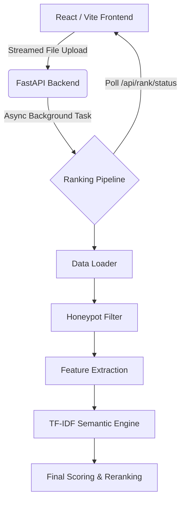

<div align="center">
  
  <h1>Redrob Candidate Ranker</h1>
  <p><strong>A Full-Stack, High-Performance Candidate Ranking & Discovery System</strong></p>
  
  <p>
    
    
    
  </p>
</div>

---

## 🌟 Overview

Redrob Candidate Ranker is an end-to-end intelligent candidate evaluation system designed to process massive datasets (e.g., 100,000+ candidates, 400MB+ files) with zero UI freezing or connection drops. 

It leverages a hybrid semantic search engine paired with a gorgeous, interactive React dashboard, enabling recruiters to quickly upload, process, and analyze candidate data in seconds.

## ✨ Key Features

- **🚀 Ultra-Fast TF-IDF Engine:** Scores 100K candidates in under 3 seconds using `scikit-learn` TF-IDF and cosine similarity, completely eliminating the need for expensive GPU inference or network calls.
- **⚡ Asynchronous Data Processing:** Large files (465MB+) are uploaded directly to the Python backend via streamed chunks. Background worker threads handle the intense processing while the UI cleanly polls for status updates, preventing browser timeouts.
- **🛡️ Honeypot Detection:** Automatically filters out fraudulent or impossible profiles (e.g., skill duration exceeding total experience) before ranking them.
- **🧠 Intelligent "Plain-Language" Matching:** Doesn't just look for keywords; it measures semantic coherence between candidate career descriptions and JD facets to defeat keyword stuffing.
- **📊 Beautiful Dashboard:** A modern, dark-mode ready UI built with Vite, React, and Tailwind CSS. Review candidates, export to CSV, and analyze rank explanations easily.

---

## 🛠️ Architecture



---

## 💻 Local Development Setup

You can run this entire system locally on **Windows, Ubuntu, or macOS**.

### 1. Clone the Repository

```bash
git clone https://github.com/deepak25000000/redrob_ranker.git
cd redrob_ranker
```
*(Alternatively, download the ZIP from GitHub, extract it, and open your terminal in the extracted folder).*

### 2. Setup the Backend (Python)

Depending on your OS, set up the virtual environment and install dependencies:

**Windows (PowerShell):**
```powershell
python -m venv .venv
.\.venv\Scripts\Activate.ps1
pip install -r requirements.txt
```

**Ubuntu / macOS (Bash/Zsh):**
```bash
python3 -m venv .venv
source .venv/bin/activate
pip install -r requirements.txt
```

### 3. Setup the Frontend (Node.js)

Ensure you have [Node.js](https://nodejs.org/) installed, then run:

```bash
cd frontend
npm install
cd ..
```

### 4. Run the Application

You can start both the backend and frontend simultaneously with a single command:

```bash
npm run dev
```

- **Frontend Application:** `http://localhost:5173`
- **Backend API Docs:** `http://localhost:8000/docs`

---

## 🎯 How to Use the System

1. **Upload Data:** Navigate to `http://localhost:5173/` and drop your `.jsonl` or `.csv` candidate file into the dropzone. 
2. **Async Processing:** Watch the real-time progress bar. Large files (like the 465MB candidates file) are handled seamlessly via background polling.
3. **Review Results:** Once processed, you will be automatically redirected to the Dashboard to view the top candidates, read AI-generated justifications, and examine skill coherence.
4. **Export:** Export the final curated list of top-ranked candidates to CSV with a single click.

---

## ⚖️ License
MIT License. Feel free to fork and modify!
